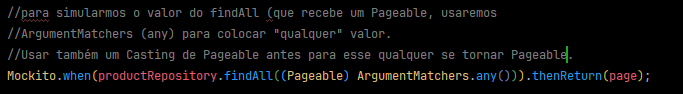

  

# Tópicos

# Parte teórica

[Tipos de teste](#tipos-de-teste)
-
- [Teste unitário](#teste-unitário)
- [Teste de integração](#teste-de-integração)
- [Teste funcional](#teste-funcional)

[Benefícios de testes automatizados](#benefícios-de-testes-automizados)
-
- [Detecção de mudanças](#1-detecta-facilmente-se-mudanças-violam-regras-do-sistema)
- [Forma de documentação](#2-é-uma-forma-de-documentação)
- [Redução de custos](#3-redução-de-custos)
- [Melhor design](#4-melhora-design-da-solução)

[TDD - Teste Driven Development](#o-que-é-tdd---test-driven-development)
-
- [Princípios e vantagens](#princípios--vantagens)
- [Como fazer](#processo-básico)

[Boas práticas para testes](#boas-práticas-para-testes)
-
- [Nomeclatura](#nomeclatura-de-um-teste)
- [Padrão AAA](#padrão-aaa)
- [Princípios inversão de dependência](#princípio-inversão-de-dependência-solid)
- [Independência e isolamento](#independência-e-isolamento)
- [Cenário único](#cenário-único)
- [Previsibilidade](#previsibilidade)

# Parte prática

[Visão geral JUnit](#visão-gerão-junit5)
-
- [Utilizando Factory para instanciar objeto](#padrão-de-projeto-factory-para-instanciar-objetos)
- [Primeiro teste na prática](#primeiro-teste-na-prática-com-junit)
- [Testando método deposit](#testando-se-o-método-deposit-está-realmente-depositando-e-descontando-a-taxa)
- [Testando deposit com quantia negativa](#testando-se-o-método-deposit-não-faz-nada-com-quantia-negativa)
- [Teste full withdraw](#teste-saque-total)
- [Teste withdraw](#teste-saque)
  - [Saldo positivo](#saque-com-saldo-positivo-maior-que-o-saque)
  - [Saldo negativo (com exceção)](#saque-com-saldo-insuficiente-exception)
- [Observação TDD](#observação-tdd)

# Objetivo

# UML

## Tipos de teste

Existem outros tipos de testes, mas abaixo falaremos dos mais comuns.

### Teste Unitário

É um teste feito pelo desenvolvedor, ele valida comportamento de **unidades funcionais de código**. Ou seja: testa os
métodos de uma classe.

Um teste unitário **NÃO** pode acessar outros componentes ou recursos externos (arquivos, bd, rede, web services, etc.).

Portanto, se estamos fazendo um teste unitário de um controlador, não podemos instanciar um Service/Repository e nem
acessar banco, rede, nem nada do tipo.

A ideia é que a gente instancie um "mock", um objeto de "mentirinha" para simular o comportamento do objeto dependente,
testando a UNIDADE de forma ISOLADA.

### Teste de Integração

Agora sim! Testamos a comunicação entre componentes e modulos da aplicação (e também recursos externos), verificando se
estão interagindo entre si corretamente.

### Teste Funcional

Um teste do ponto de vista do usuário. Se uma determinada funcionalidade está executando corretamente, produzindo o
resultado ou comportamento desejado pelo usuário (**casos de uso, por exemplo**).

## Benefícios de testes automizados

### 1. Detecta facilmente se mudanças violam regras do sistema

Quando atualizarmos algo no sistema, mudar alguma implementação apertaremos um botão! E esses testes irão rodar, 
verificando se alguma coisa violou as regras da aplicação.

### 2. É uma forma de documentação

Lendo a documentação do teste, ele registra o comportamento, ou seja, nos informa como o teste deve se comportar
(entrada e saídas esperadas), se deverá gerar uma exceção, etc. 

### 3. Redução de custos

Se fizermos alguma manutenção no sistema e ele possuir, estiver coberto de vários testes automizados, será muito mais
fácil validar a manutenção (o que geralmente é bem caro).

### 4. Melhora design da solução

Uma aplicação testável precisa ser bem desenhada e projetada.

## O que é TDD - Test Driven Development

É um **metodo** de desenvolver software. Considere um desenvolvimento guiado pelos testes. Não é porque seu software
possui testes automatizados que ele é TDD.

### Princípios / vantagens:

- Foco nos requisitos (iniciar o projeto escrevendo os testes primeiro)
- Tende a melhorar design do código, pois o código deverá ser testável
- Acréscimos no projeto têm menos chance de quebrar a aplicação (passar nos testes)

### Processo básico:

1. Escreva o teste como esperado (naturalmente que ele ainda estará falhando)
2. Implemente o código necessário para que o teste passe
3. Refatore o código conforme for necessário

## Boas práticas para testes

### Nomeclatura de um teste

``<AÇÂO> should <EFEITO> [when <CENARIO>]``

Leia-se exemplo: ``<método delete> SHOULD <deletar objeto> [<when ID existir>]``

### Padrão AAA

- Arrange: instancie os objetos necessários (um New ou algo do tipo)
- Act: execute as ações necessárias (deletar, inserir algo/regra de negócio)
- Assert: declare o que deveria acontecer (resultado esperado)

### Princípio inversão de dependência (SOLID)

Se uma classe A depende de uma instância da classe B, não tem como testar a classe A de forma isolada. Na verdade, nem
seria um teste unitário. Por isso utilizamos o AutoWired ou construtores.

A inversão de controle ajuda na testabilidade e garante o isolamento da unidade a ser testada. Ou seja, ao invés de
instanciarmos a classe B, instanciaremos o **Mock**, o objeto de "mentirinha" que simulará o **comportamento** da classe B.

### Independência e isolamento

Um teste não pode depender de outros testes, nem da ordem de execução.

### Cenário único

- O teste deve ter uma lógica simples, linear
- O teste deve testar apenas um cenário
  - Igual o exemplo acima. Se você faz um teste para deletar um ID existente, deve existir OUTRO teste para deletar com
  um ID não existente
- Não use condicionais e loops

### Previsibilidade

O resultado do teste deve ser sempre o mesmo para os mesmos dados.

Ou seja, não é uma boa fazer o resultado do teste depender de algo que pode variar (tipo timestamp atual (Instant.now()))
e valores aleatórios.

## Visão gerão Junit5

### [Site](https://junit.org/junit5/)

1. Criar uma classe de testes
2. A classe pode conter um ou mais métodos com a annotation @Test
3. Um método de @Test deve ser void
4. O objetivo é que todos os métodos @Test passem sem falhas
5. O que define se um método @Test passa ou não são as "assertions" deste método
6. Se um ou mais falhas ocorrem, estão são mostradas depois da execução do teste

## Primeiro teste na prática com JUnit

Inicialmente já sabemos que na nossa aplicação Spring é criado automaticamente um pacote "test". Assim sendo, se formos
testar uma entidade, criar um pacote entities, se for repository uma de respositoy e assim vai...

No exemplo abaixo é uma aplicação sem Spring ou ela possui uma classe Account com atributo Id e balance + getters e
setters e métodos de: deposit, withdraw e fullWithdraw:

No pacote test > entities: criar "AccountTests" onde ficará todos os testes pertinentes a essa entidade.

### Testando se o método deposit está realmente depositando e descontando a taxa

Agora aplicamos tudo da parte prática.

A nomeclatura sendo: o nome do método + "should" + efeito do método + cenario

E o padrão AAA: instanciando o objeto, executando a ação e depois aferindo o resultado.

### Testando se o método deposit não faz nada com quantia negativa

Tentando depositar uma quantia negativa.

Instanciamos a conta com um valor esperado. Ao realizar o depósito negativo, o valor deve continuar o mesmo.

### Teste saque total

Deve limpar o saldo e retornar todo o saldo.

Temos dois assertions porque:

O primeiro: testa se o valor que a gente espera de fato é zero.

O segundo: testa para ver se o retorno (o que foi sacado) é igual ao balanço inicial.

### Teste saque

Um cenário onde a quantia que queremos sacar está ok! E outro quando a quantia que queremos sacar é superior ao saldo
onde terá uma exception.

#### Saque com saldo positivo (maior que o saque)

#### Saque com saldo insuficiente (exception)

Agora não será somente assertTrue ou That e sim **Throws, em virtude da exception!**

E o AA ficará dentro de uma expressão lambda, veja:

## Padrão de projeto Factory para instanciar objetos

O ideal é que tenhamos uma classe para instanciar objetos para gente (caso seja uma operação repetitiva no sistema).

No pacote testes criar um pacote factory. Como a classe é Account se chamará **AccountFactory**. Criaremos um método
para instanciar uma Account vazia (esses métodos geralmente são estáticos).

Como visto acima, pode ser até mesmo **uma classe com um valor pré-definido**.

Agora dentro dos testes, ao invés de instanciar um new Account, utilizaremos a factory.

## Observação TDD

O que fizemos acima, não foi TDD. Seria somente se tivéssemos criado no máximo a classe Account sem os métodos, somente
atributos com getters e setters.

O ideal seria criar a classe de Testes, exatamente como está ali em cima depois implementar os métodos.

## Exercício JUnit vanilla

## Inserindo tudo no projeto DSCatalog

Até o momento, utilizamos o que aprendemos em um projetinho a parte. Agora, faremos em um projeto maior.

## Annotations usadas nas classes de teste

### 1. @SpringBootTest

Carrega o contexto da aplicação **(teste de integração)**. Ou seja, é um teste lento, pois carrega muita coisa para ele
rodar.

Portanto, se usa essa anotação quando você quer carregar outros componentes do sistema.

### 2. @SpringBootTest e @AutoConfigureMockMvc

Quando você combina as duas anotações acima, você carrega o contexto da aplicação (teste de integração e web) e trata 
as requisições sem subir o servidor tomcat.

### 3. @WebMvcTest(Classe.class)

Carrega o contexto, mas somente da camada web (teste de unidade: controlador), não vai carregar os outros (service,
repository).

### 4. @ExtendedWith(SpringExtension.class)

Não carrega o contexto, mas permite usar recursos do Spring com JUnit (teste de unidade: service/component).

### 5. @DataJpaTest

Carrega somente os componentes relacionados ao Spring Data JPA. 

Cada teste é transicional e dá rollblack no final (teste de unidade: repository).

O rollback basicamente é: ele vai executar o que tem pra executar (do repository) acessando o banco de dados e depois 
volta.

## Primeiro teste no repository

## Organizando melhor código evitando repetição - Fixtures no JUnit, BeforeEach

No caso acima, nós poderiamos ter instanciado uma variável de ID existente e outra de não existente para realizar o
teste.

Imagine outros métodos da mesma classe que também podem precisar da mesma coisa? Evitando repetição de código, podemos
usar as **fixtures!** Elas nos permitem declarar alguma coisa, e executar elas em momentos específicos do teste.

| Junit5      | Junit4       | Objetivo                                                                           |
|-------------|--------------|------------------------------------------------------------------------------------|
| @BeforeAll  | @BeforeClass | (instancia uma vez só) Preparação antes de todos tests da classe (método estático) |
| @AfterAll   | @AfterClass  | Preparação depois de todos testes da classe (método estático)                      |
| @BeforeEach | @Before      | (instancia mais de uma vez) Preparação antes de cada teste da classe               |
| @AfterEach  | @After       | Preparação depois de cada tste da classe                                           |

Dando continuação ao exemplo acima de como instanciar essas clases para reaproveitá-las, faremos o seguinte:

Iremos declarar as classes lá em cima e depois, inicializá-las dentro de um método com @BeforeEach.

Depois, é só reutilizar dentro dos métodos de teste.

## Testando save com id nulo

Quano criamos um novo item, o Spring entende que mesmo o id sendo nulo ele irá autoincrementar. 

Faremos um teste para ver se ele irá fazer isso! Como temos 25 produtos, testaremos para ver se ele cria o 26.

❗Lembrar de criar Factory para reutilizar classes:

## Exercício - Teste Repository (Product com id existente e não existente)

findById deveria:

Retornar um Optional<Product> não vazio quando o id existir.

Retornar um Optional<Product> vazio quando o id não existir.

## Começando com testes de ProductService, Mockito vs Mockbean

Agora sim começaremos nos testes de unidade, onde testaremos aquela classe específica sem carregar um outro componente
que ela depende.

Para realizar isso, precisamos "mockar" essas dependências utilizando o Mockito.

Como vimos na tabela acima, quando é um teste de unidade na camada de serviço usamos: @ExtendWith e para instanciar as
dependências usaremos @Mock ou @MockBean.

### Mockito vs MockBean

[Link de discussão sobre](https://stackoverflow.com/questions/44200720/difference-between-mock-mockbean-and-mockito-mock)

## Primeiro teste, simulando comportamento com Mockito

Primeiramente a gente precisa lembrar que o teste de unidade (do service, neste caso), não irá acessar o repository que
por sua vez acessará o banco, afinal o service não tem acesso ao banco de dados real.

Primeira coisa: criar novamente o SetUp com BeforeEach e instanciar variáveis a serem reutilizadas.

Além disso, dentro do SetUp colocaremos alguns comportamentos esperados do Mock:

Cabe destacar, esse método terá OUTROS métodos adicionais (findById, coisas de Pageable, etc.). Ele serve justamente
para isso, **preparar cenários específicos**.

Depois é o padrão dentro dos métodos, neste caso é para verificar o delete do service.

## Teste delete lança ResourceNotFoundException quando id não existe

Esse método da trigger nesse cenário que criamos no SetUp, por exemplo:

## Teste delete lança DatabaseException quando id dependente

Pro teste passar, ele tem que passar pelo if do delete do service, pelo try e cair no cactch, veja:

Criar um dependentId:

E criar o cenário de trigger:

## Simulando comportamentos diversos com Mockito (findAll - Pageable, save, findById)

### findAll (Pageable)

1. Criar um atributo PageImpl do tipo Product chamado Page. Ele irá representar um tipo concreto que representa uma 
página de dados.

2. Criar um atributo do tipo Product.

3. Instanciá-los dentro do SetUp:

### Para settar os triggers do Mockito:

### Save

Só reaproveitar os atributos criados e usar o any() de novo.

### findById (existente e não existente)

## Testando findAllPaged do ProductService

